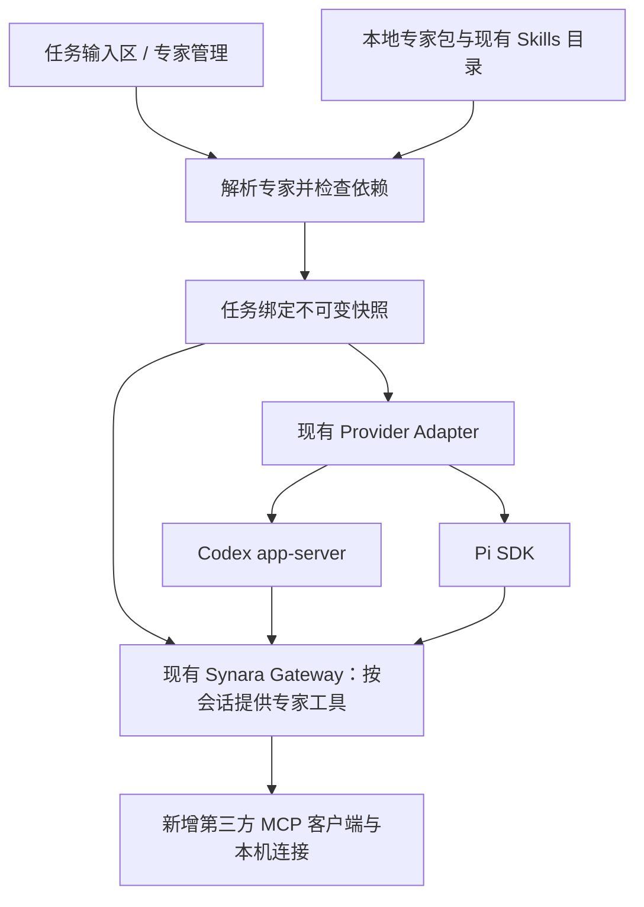

# Synara Expert 产品与技术方案

状态：首版产品链路已经实施：专家编辑、预检、任务快照绑定、Codex / Pi 加载、恢复、接续任务，以及本机第三方 MCP 连接管理和按专家工具允许列表路由均已接入。必需连接会在新会话启动前实测并阻止失败启动；可选连接失败时降级并写入专家上下文。连接按 Provider session 隔离，并在 Gateway 凭据撤销且在途请求排空后关闭。Codex、Pi SDK 与 MCP 的 P0 验证结果见 [技术验证记录](./expert-p0/README.md)。  
调研日期：2026-09-24。代码基线：`eaa61eded31b6755d4f30ba8eabc5d905cf817cb`。  
范围：在现有 Synara 内增加跨 Codex / Pi 的专家能力。暂按个人使用优先、以后可分享专家包设计；团队权限和公开市场不作为首版前提。

## 1. 建议与产品定位

**Expert 是可复用、可检查、可固定版本的工作能力配置；Task 是实际工作的承载者。**

用户维护“产品经理、UI 设计师、研究员”等专家，每个专家组合 Persona、Skills、工具依赖、参考资料和运行偏好。开始任务时选择专家，Synara 检查当前运行环境并加载配置；更换 Codex / Pi 时保留专家定义，重新适配运行环境。

核心价值是减少重复配置，并让用户知道“这次实际加载了什么、哪些能力可用”。不能承诺相同专家在不同模型上产生完全相同的结果。

Expert 在产品上是一级对象，在实现上先做现有任务系统的扩展。不另建 Agent Runtime、调度框架或 Persona 切换 CLI。

| 对象          | 负责什么                                       | 不承载什么                   |
| ------------- | ---------------------------------------------- | ---------------------------- |
| Expert        | 角色、方法、技能组合、工具依赖、资料、运行偏好 | 登录凭证、某次任务的对话历史 |
| Skill         | 可复用工作流程及配套脚本、资源                 | 专家身份和账号授权           |
| Connection    | 本机工具连接及认证引用                         | 专家 Persona                 |
| Task / Thread | 当前目标、工作区、对话、专家快照、实际运行记录 | 可随意变化的专家模板         |
| Provider      | Codex / Pi 等 Harness 的原生行为               | 跨 Harness 的统一业务定义    |

例如“产品经理专家”不是一句“你是资深产品经理”，而是：先区分事实与假设的工作原则 + 需求澄清/PRD 技能 + 已连接的资料工具 + 用户自己的 PRD 模板。

## 2. 源码核实：已有能力与实际缺口

以下为当前代码观察；后续章节均为建议新增的设计。

| 代码事实                                                                                 | 对方案的影响                                                                      | 依据                                                                                                                                |
| ---------------------------------------------------------------------------------------- | --------------------------------------------------------------------------------- | ----------------------------------------------------------------------------------------------------------------------------------- |
| 已有统一 Skills 发现，聚合 Synara、Provider 与项目来源，并按名称去重                     | 复用发现与选择界面；专家必须固定具体来源，避免换 Provider 后同名技能变内容        | [skillsCatalog.ts](../apps/server/src/provider/skillsCatalog.ts)                                                                    |
| 已有 Settings → Skills；禁用主要作用于 Synara 的选择入口                                 | 不能把“UI 隐藏技能”当作运行时技能隔离                                             | [SkillsSettingsPanel.tsx](../apps/web/src/components/settings/SkillsSettingsPanel.tsx)                                              |
| Codex 每次创建任务会话时启动 app-server；有额外 Skill 根目录注册                         | 可在会话创建边界接入专家；注册失败不能对必需 Skill 静默忽略                       | [codexAppServerManager.ts](../apps/server/src/codexAppServerManager.ts)                                                             |
| Codex 已有 home overlay，但路径不是按 thread 分开的，且会链接已有用户资源                | 不能向这个共享 overlay 写入可变专家配置；仅建新目录也不等于认证与状态隔离已经正确 | [codexHomePaths.ts](../apps/server/src/codexHomePaths.ts)、[codexProcessEnv.ts](../apps/server/src/codexProcessEnv.ts)              |
| Pi 使用 `@earendil-works/pi-coding-agent` SDK；会话服务与资源加载由 Adapter 构造         | Persona / Skills 优先通过会话资源注入，不需要切用户的全局 agentDir                | [PiAdapter.ts](../apps/server/src/provider/Layers/PiAdapter.ts)、[依赖声明](../apps/server/package.json)                            |
| Pi 已把 Synara Gateway 的 MCP 工具映射成 customTools                                     | 可复用工具映射模式，但这不是通用第三方 MCP Client                                 | [PiAdapter.ts](../apps/server/src/provider/Layers/PiAdapter.ts)、[mcpInjection.ts](../apps/server/src/agentGateway/mcpInjection.ts) |
| Gateway 已有 thread / provider / turn 身份与权限边界                                     | 专家工具路由应延续这些边界，不以客户端传来的 threadId 作为授权依据                | [AgentGatewaySessionRegistry.ts](../apps/server/src/agentGateway/Services/AgentGatewaySessionRegistry.ts)                           |
| 跨 Provider handoff 实际生成新 threadId，再导入历史；已开始的 thread 不直接更换 Provider | Expert 快照随 handoff 继承；首版不重写任务身份模型                                | [useThreadHandoff.ts](../apps/web/src/hooks/useThreadHandoff.ts)、[decider.ts](../apps/server/src/orchestration/decider.ts)         |
| handoff 给接收方的是有预算上限的上下文整理                                               | 可迁移的是工作信息，不是原生推理、子 Agent、工具状态或完整上下文                  | [handoff.ts](../apps/server/src/orchestration/handoff.ts)                                                                           |

因此，关联对话中的“Expert 绑定 Task”“运行时适配”方向可以保留，但需要修正三点：

1. 不将 handoff 设计为现有 thread 原地换 Provider；界面可表达为继续工作，数据层沿用派生 thread。
2. 不假设写一份 Pi `mcp.json` 就会在 Synara 中生效；必须走实际 SDK 和工具接入路径。
3. 不把所有 Provider 都能读取 `SKILL.md` 等同于技能完全兼容。内部调用了专有工具的 Skill 仍可能只能在一个 Harness 使用。

## 3. 首版用户体验

### 3.1 三个入口

| 入口             | 用户看到什么                                       | 主要操作                               |
| ---------------- | -------------------------------------------------- | -------------------------------------- |
| 新任务输入区     | `专家：通用 ▾`，旁边保留当前 Provider / 模型       | 选择专家、查看是否就绪、开始任务       |
| 专家管理页       | 我的专家、简短用途、支持的运行时、缺失依赖         | 新建、复制、编辑、归档、从本地目录导入 |
| 任务中的专家详情 | 固定版本、角色摘要、所选技能、实际工具、未启用原因 | 检查实际配置、复制专家、用另一专家继续 |

首版管理页可放在设置中，但任务输入区必须可直接选专家。不为了“一级对象”立即重排整个侧栏。

### 3.2 一次完整使用

1. 用户选择“产品经理”，输入“分析这个功能并写 PRD”。
2. Synara 使用用户选定的 Provider，未选择时参考专家偏好，再使用现有应用默认值。
3. 输入区显示“3 个技能可用；资料库未连接，将无法读取团队文档”。必需依赖未满足则阻止开始；可选依赖缺失时可继续，并保留缺失说明。
4. 首次发送时生成不可变专家快照，启动运行环境。任务开始后显示“产品经理 · 固定版本”及实际状态。
5. 任务输出继续走现有对话、文件、diff 和审查界面。
6. 切到 Pi 时先检查同一专家快照在 Pi 上的兼容性，然后使用现有 handoff 创建接续任务。

就绪状态采用：**可用 / 部分能力可用 / 需连接 / 不兼容 / 运行失败**。配置解析成功只能表示“配置有效”；Provider 确认资源已加载、工具已连接后才能表示“已生效”。

### 3.3 专家编辑器

用户表单按五组组织，源码格式作为高级入口：

| 配置组     | 内容                                                  | 设计约束                                               |
| ---------- | ----------------------------------------------------- | ------------------------------------------------------ |
| 基本信息   | 名称、用途、适用任务、开场示例                        | 不要求头像、分类体系或市场元数据                       |
| 工作方式   | 角色、工作原则、输出要求、边界                        | Persona 写短；长流程放进 Skill                         |
| 技能       | 新增、修改、删除本机 Skill 引用，或从发现目录快捷选择 | 显示名称与入口路径；同一路径去重；同名冲突必须明确选择 |
| 工具与资料 | 所需连接、可用工具范围、参考文件                      | 凭证在本机连接设置中管理                               |
| 运行偏好   | 首选 Provider、Provider 专属模型选项                  | 用户显式选择优先；不自动提高权限                       |

建议先内置三个可编辑示例：产品经理、UI 设计师、代码审查员。第三方服务默认作为可选依赖，避免首次使用就必须登录多个平台。

## 4. 生命周期与切换规则

| 操作                 | 推荐行为                                                               |
| -------------------- | ---------------------------------------------------------------------- |
| 第一次发送前换专家   | 修改草稿选择，重新检查，尚不固定快照                                   |
| 修改专家模板         | 生成新 revision；已开始任务仍使用原快照                                |
| 当前任务升级专家版本 | 明确发起“用新版继续”，生成派生任务和新快照                             |
| 已开始任务换专家     | 首版创建派生任务，在新原生会话里加载新专家，并带入有界工作摘要         |
| 运行中点击换专家     | 保留当前运行状态，待结束或用户中断后再执行；不在活跃工具调用中替换配置 |
| 同一专家换 Provider  | 复用 handoff，新 thread 继承相同 snapshotId，重新编译和验证            |
| 原生 fork，专家不变  | 继承快照，并验证接收会话确实加载对应版本                               |
| 归档专家             | 从新任务选择中隐藏，保留已有任务及其快照                               |
| 重启 / 恢复任务      | 从持久化绑定和快照恢复，不重新解析最新模板                             |

“换专家继续”不能直接照搬原生 fork：原生会话可能携带旧角色指令。应复用派生任务、历史整理和界面模式，但新开原生会话；传入的旧对话只作为历史事实，当前专家配置重新生效。

首版不做运行中无缝热切换、多专家同时主导一个任务、专家自动组队。这里的“快速切换”是少量操作后可靠启动，不是承诺零重启或零上下文损失。

## 5. 总体结构



这些是职责边界，首版都在现有 server 进程中实现。无需拆微服务或创建独立 Expert Runtime。

实现增加两块主要逻辑：

- **专家解析与快照**：读取包、解析来源、校验文件、检查兼容性、固定内容，输出 Provider 无关的配置。
- **专家工具连接**：为任务解析 MCP 连接，维护生命周期，经现有 Gateway 暴露给 Codex 与 Pi。

Provider-specific 投影留在现有 Adapter 内。跨进程 Schema 放 `packages/contracts`；运行逻辑留在 server，遵循仓库当前 Effect 与持久化约定。

## 6. 专家包与数据设计

### 6.1 源文件

建议先用 `expert.json + PERSONA.md + 标准 SKILL.md`。前一轮的 `expert.yaml` 可以表达同样信息，但首版 JSON 已足够，能直接使用现有 Schema 校验，无需同时维护两种格式。

```text
<Synara 数据目录>/experts/product-manager/
├── expert.json
├── PERSONA.md
├── skills/
│   └── write-prd/
│       ├── SKILL.md
│       └── references/
└── references/
    └── prd-template.md
```

数据目录必须使用项目已有配置解析结果，不硬编码 `~/.synara`；文件路径以专家包为根解析。

下面是提议的格式，不是当前 Synara 已支持的配置：

```json
{
  "schemaVersion": 1,
  "id": "product-manager",
  "name": "产品经理",
  "description": "澄清需求、比较方案并形成可验收的 PRD",
  "persona": "PERSONA.md",
  "skills": [{ "path": "skills/write-prd", "required": true }],
  "connections": [
    {
      "id": "team-docs",
      "required": false,
      "tools": ["search", "fetch"]
    }
  ],
  "references": ["references/prd-template.md"],
  "runtime": {
    "preferredProvider": "codex",
    "codex": { "reasoningEffort": "high" },
    "pi": { "thinkingLevel": "high" }
  }
}
```

`team-docs` 是示例连接 ID，`search/fetch` 是示例工具名，必须映射到本机真实工具目录。运行偏好字段由 Adapter 校验并转成原生字段，不能把两种 Harness 的 effort 字符串直接互传。

从现有目录挑选 Skill 时，首版将用户选定的 Skill 文件夹复制进专家包，记录来源，保留更新动作。无需立即建立跨 Provider 的全局 Skill ID 注册中心。这样便于导出，也避免同名技能自动替换。脚本和引用资源必须一起复制；来源不允许复制或绑定机器环境的技能应标为不可移植。

### 6.2 三种数据不要混在一起

| 数据                | 建议位置 / 内容                                                  | 变化规则                                                     |
| ------------------- | ---------------------------------------------------------------- | ------------------------------------------------------------ |
| ExpertDefinition    | 本地目录，含用户可编辑源文件                                     | 保存时计算内容 revision，可继续修改                          |
| ExpertSnapshot      | Synara 管理的不可变资源目录 + manifest                           | 内容哈希覆盖 Persona、Skill 全目录、参考资料及配置；不含凭证 |
| ThreadExpertBinding | 现有事件和 projection 内的 `expertId / snapshotId / displayName` | 第一次发送固定；旧线程默认无绑定                             |

运行期另产生 **applied 配置记录**：snapshotId、实际 Provider / SDK / CLI 版本、实际模型、资源目录、已连接工具、缺失项和 lifecycle generation。它用于诊断，不是新的可编辑配置源。

快照应复制真实内容，不能只保存指向可变目录的软链接。创建时先完整暂存、校验 hash，再原子发布，随后持久化任务绑定；失败后未绑定快照可清理。已绑定快照只能在无引用且满足保留策略时删除。导出任务若要跨机器恢复，也必须携带快照，不能只导出本机路径。

首版专家库以文件为事实来源；任务绑定进入现有 SQLite / 事件投影。不为同一份可编辑 manifest 再造一套平行数据库事实来源。

### 6.3 合并规则

- 运行偏好：用户本次显式选择 > 专家偏好 > 现有项目与应用默认值；最终必须在运行时发现的能力范围内。
- 权限：保持现有用户授权与运行时安全约束；Expert 只能声明需求，不能把 Ask 改成 Full access。
- 项目指令：继续由 Harness 加载，Persona 补充专业方法；跨 Harness 不承诺统一的系统提示优先级。
- 技能：快照中的具体来源胜出，不能重新按“当前 Provider 原生同名版本优先”解析。
- 资料：默认注入简短目录和用途，按需读取正文；不把全部文档直接塞入系统提示。首版不需要向量库。
- 必需能力：缺失时阻止启动；可选能力：明确记录降级。全局禁用与专家必需技能冲突时显示冲突，不偷偷重新启用。

## 7. Codex 与 Pi 的适配

### 7.1 能力矩阵

| 需求          | Codex 接入方案                                     | Pi 接入方案                                                    |
| ------------- | -------------------------------------------------- | -------------------------------------------------------------- |
| Persona       | 使用会话配置的附加开发者指令，避免替换全部基础指令 | 在会话 ResourceLoader 中追加专家提示，保留基础行为和项目上下文 |
| Skills        | 注册快照技能目录；发现后按需使用原生 skill 输入    | 将快照技能加入会话资源加载，按需读取 / 激活                    |
| 参考文件      | 提供受允许的绝对路径与目录索引                     | 相同快照资料索引                                               |
| 专家 MCP 工具 | 通过现有 Synara MCP Gateway 提供                   | 延用 Gateway → customTools 映射模式                            |
| 模型选项      | 使用现有模型发现与 Codex 选项校验                  | 使用 Pi 模型注册表与 thinking level 校验                       |
| 恢复          | 原绑定快照重新投影，检查恢复结果                   | 重建服务和订阅时重新投影同一快照                               |

官方资料支持 Codex 的附加 `developer_instructions`、Skills 输入和版本对应的协议生成；具体启动参数以目标 CLI 导出的 Schema 为准，不依据旧对话猜字段。见 [Codex 配置参考](https://developers.openai.com/codex/config-reference)、[App Server](https://developers.openai.com/codex/app-server)。

Pi SDK 可显式提供 ResourceLoader、SettingsManager 和 customTools；具体追加方式以本仓库锁定版本的类型为准。见 [Pi SDK](https://github.com/earendil-works/pi/blob/main/packages/coding-agent/docs/sdk.md)、[提示配置示例](https://github.com/earendil-works/pi/blob/main/packages/coding-agent/examples/sdk/03-custom-prompt.ts)、[技能配置示例](https://github.com/earendil-works/pi/blob/main/packages/coding-agent/examples/sdk/04-skills.ts)。

### 7.2 隔离首先是配置作用域

优先使用会话参数和会话资源，专家快照资源按内容独立保存。Codex 现有共享 overlay 继续用于原来的公共运行配置，但专家的 Persona 和 Skill 选择不能写进去。

第一步验证目标 Codex 版本能否通过 thread start/resume 配置传入附加指令，并让每个 app-server 的额外 Skill 根目录分别生效。若接口不足，再使用该独立进程的配置参数；只有确实需要文件级配置时才引入专用 overlay 路径，并完整验证认证复用、会话恢复、SQLite、生成文件访问和进程清理。

Pi 复用当前凭证与模型来源，单独构造资源加载。不得通过修改 `process.env` 或全局 `agentDir` 为两个并行会话切专家。

首版隔离承诺是：**任务 A 的专家选择不会改掉任务 B 的专家选择。** 用户原有全局或项目 Skills、原生工具可能继续存在，需要在详情中区分“专家提供”和“环境继承”。专家列表不是安全沙箱，也不应标成“仅能使用这些工具”。若以后要严格只允许指定工具，需要额外验证原生扩展、shell 和网络边界。

### 7.3 Skills 的可用不等于每轮强制执行

Persona 作为稳定角色上下文；Skills 先提供名称、触发条件和路径，任务匹配时再加载全文。不能为省事将所有技能每一轮都显式调用。

为跨 Harness 的技能提供兼容性检查：文件可读、依赖可用、专有工具引用是否有对应能力。首版可以由作者声明支持范围，再用真实任务验证；静态扫描不能证明语义等价。

## 8. MCP 方案：复用 Gateway，补足下游连接

需要区分两条方向：

- 现有 External MCP 面向“其他客户端调用 Synara”。它不是专家调用 Figma、资料库等服务的完整连接管理器。
- 新增专家 MCP 面向“Synara 中的 Agent 调用外部服务”。需要下游 MCP Client、认证引用、资源生命周期和工具路由。

推荐首版将**专家管理的外部工具**统一接到现有 Agent Gateway，理由是 Codex 与 Pi 已有接入这条 Gateway 的路径，权限与工具映射能够共用。用户原有 Provider MCP 设置仍独立存在，导入时再显式转成 Synara Connection。

不直接复用 `mcpInjection.ts` 中面向 Synara 的简化 HTTP 请求器冒充通用 MCP Client。通用连接应使用协议 SDK；当前直接依赖中未找到完整客户端时，应明确增加必要的直接依赖，避免手写协议或依赖未声明的传递依赖。

最小实现边界：

| 项目       | 首版规则                                                                                       |
| ---------- | ---------------------------------------------------------------------------------------------- |
| Transport  | stdio 与 Streamable HTTP；不承诺所有旧式 SSE 服务                                              |
| 认证       | 本机环境变量 / 凭证引用；首版不把交互 OAuth 设为发布前提，OAuth-only 服务显示不支持            |
| MCP 范围   | tools/list、tools/call 及必要连接协议；resources/prompts/sampling/elicitation 按能力报告不支持 |
| 工具选择   | Connection + 显式工具允许列表，在 Gateway 服务端强制检查                                       |
| 工具命名   | 稳定命名空间，如 `expert_<connection>_<tool>`；超长或冲突时使用确定性映射并保留原名            |
| 连接归属   | 先按 Provider session 管理，避免不明共享状态；待有性能证据再做连接池                           |
| 取消与退出 | 工具请求传递取消信号；关闭客户端和 stdio 子进程；退出失败必须可见                              |
| 授权       | 复用现有交互通道，但新增外部工具的服务端检查；未知写入风险默认需要确认，工具注解只是提示       |
| Token      | 仍使用会话凭证；旧 generation 撤销后不能访问新专家的工具                                       |

Gateway 的 `tools/list` 和 `tools/call` 必须按已验证 session identity 查询当前专家绑定，不能相信工具参数中的 `expertId/threadId`。第一版工具集合在会话内固定；变更在新的会话启动时应用，避免多 Provider 的热更新差异。

同一外部服务如果同时来自原生配置和专家连接，详情中提示重复来源，给出移除专家依赖或停用原生来源的明确选择；不自动删除用户配置。

## 9. 改动位置与接口建议

以下是实现切入点，不是要求一次性建立所有文件或抽象。

| 区域                                                                                                                                           | 改动                                                                           |
| ---------------------------------------------------------------------------------------------------------------------------------------------- | ------------------------------------------------------------------------------ |
| `packages/contracts/src/expert.ts`（新增）                                                                                                     | Definition、Snapshot 摘要、兼容性报告、RPC 输入输出 Schema                     |
| [orchestration.ts](../packages/contracts/src/orchestration.ts)                                                                                 | thread 创建、fork、handoff、恢复及完整/轻量 snapshot 都携带可空 expert binding |
| [provider.ts](../packages/contracts/src/provider.ts)                                                                                           | 会话启动传递服务端解析的专家配置引用；保留旧调用兼容                           |
| [rpc.ts](../packages/contracts/src/rpc.ts) 与现有服务路由                                                                                      | 增加专家 list/read/save/archive/import/preview；沿用当前通信机制               |
| `apps/server/src/experts/`（新增）                                                                                                             | manifest 校验、路径解析、资源快照、兼容性检查；按现有 Effect service 约定组织  |
| [ProviderCommandReactor.ts](../apps/server/src/orchestration/Layers/ProviderCommandReactor.ts)                                                 | 会话建立前解析绑定；重启、恢复与重试带相同快照；维护准备/生效/失败状态         |
| [decider.ts](../apps/server/src/orchestration/decider.ts) 和 projection                                                                        | 将绑定纳入事件、重放与旧数据默认值；handoff 从源任务继承                       |
| [ProjectionThreads.ts](../apps/server/src/persistence/Layers/ProjectionThreads.ts) 和 Migrations                                               | 保存绑定；原任务无专家时行为不变；迁移按仓库 lineage 规则                      |
| [CodexAdapter.ts](../apps/server/src/provider/Layers/CodexAdapter.ts)、[codexAppServerManager.ts](../apps/server/src/codexAppServerManager.ts) | 传入 Persona、注册快照技能、对必需能力失败关闭                                 |
| [PiAdapter.ts](../apps/server/src/provider/Layers/PiAdapter.ts)                                                                                | 在 runtime factory 重建时注入资源，保留事件订阅和进程监管                      |
| `apps/server/src/agentGateway/`                                                                                                                | 专家工具目录、会话允许列表、下游连接调用与清理                                 |
| `apps/web/src/components/settings/` 与现有 composer                                                                                            | 专家编辑、选择、依赖状态和实际配置；复用 Picker、SettingsRow 等组件            |
| [useThreadHandoff.ts](../apps/web/src/hooks/useThreadHandoff.ts)                                                                               | 展示兼容性预检；绑定由服务端继承，避免 UI 漏传                                 |

接口建议：`experts.list/read/save/archive/import/preview`。`preview` 返回 resolved summary、缺失依赖和不兼容项，不创建运行会话。`save` 带 expectedRevision 防止覆盖外部编辑；快照创建和绑定由实际启动路径在服务端完成。

不能只在 UI 存 expertId。所有创建来源——普通任务、fork/handoff、自动化、外部调用——必须有明确默认行为：普通新任务可不绑定；派生任务默认继承；自动化首版固定 snapshotId；外部调用不支持指定专家时应明确拒绝对应字段，而不是悄悄忽略。

## 10. 失败处理与验证

包导入不执行任何代码。校验 Schema、文件大小、文件数量、相对路径和 realpath；拒绝越界软链接。专家内容与第三方工具输出都是不可信输入，不得借此扩大应用授权。

必需 Skill 无法注册、必需工具连接失败或快照损坏时，任务保持可恢复的失败状态，不伪装成通用助手继续执行。可选失败进入明确降级状态。原生恢复失败创建新会话时，重新应用快照并保留现有上下文恢复提示。

| 验收场景                         | 判定标准                                                         |
| -------------------------------- | ---------------------------------------------------------------- |
| 两个不同专家在同一 Provider 并行 | 提示、快照技能目录和 Gateway 工具目录分别正确，互不覆盖          |
| 相同快照分别在 Codex / Pi 执行   | 资源 hash 相同；完成约定工作流程；不要求答案逐字相同             |
| 修改 / 归档原模板后恢复旧任务    | 仍使用旧内容；不得读取模板最新文件冒充快照                       |
| Codex → Pi → Codex handoff       | 每个派生线程继承 snapshotId；实际工具和版本重新检查              |
| 同名技能出现在多个 Provider 目录 | 专家任务仍使用被固定的来源                                       |
| 旧 Codex 不支持额外 Skill 根目录 | 必需技能阻止启动，可选技能提示缺失；UI 不显示虚假就绪            |
| 取消、连接断开、进程退出失败     | 请求结束状态准确；无权限仍有效的遗留会话；无法证明清理时报告失败 |
| 一次专家切换中途崩溃             | 旧任务可继续；新任务保持待准备或失败，不出现“新标签、旧配置”     |
| 恶意包、越界路径、凭证字段       | 导入拒绝或要求修正；导出与诊断不含凭证                           |
| 旧任务 / 未选择专家              | 保持当前行为，历史事件仍可重放                                   |

实现阶段沿用已有 Vitest，不建立新测试框架。优先覆盖解析快照、会话启动、继承和 Gateway 授权边界，再用真实 Codex / Pi 各执行一组小任务及并行/恢复案例。mock 成功不作为运行时兼容的证明。

## 11. 实施顺序与发布范围

| 阶段           | 交付                                                                 | 进入下一阶段的条件                                                                                                |
| -------------- | -------------------------------------------------------------------- | ----------------------------------------------------------------------------------------------------------------- |
| P0：技术验证   | Codex 附加指令与独立 Skill 根目录；Pi 资源注入；两端各跑一个专家工具 | 真实环境验证并行、恢复、取消；记录 CLI / SDK 版本和实际能力                                                       |
| P1：内部试用   | 本地专家 CRUD、Persona、Skills、资料、快照、任务选择                 | 三个示例专家可重复使用；全局用户配置无专家写入                                                                    |
| P2：完整 MVP   | 专家 MCP 连接、允许列表、状态检查、handoff 继承、换专家继续、诊断    | 主体链路、任务诊断视图、SDK/CLI 版本与 lifecycle generation 持久记录和发布故障矩阵已完成；仍需 Linux/Windows 实测 |
| P3：有需求再做 | 专家包导出分享、Git 来源、OAuth、团队分发、项目默认专家              | 实际使用证明有需求，并有维护能力                                                                                  |

P1 只是内部增量；**对外宣称支持 Persona + Skills + MCP 的跨 Harness Expert，必须以 P2 为完成标准。**

规模判断：这不只是一个选择器。主要成本集中在 Provider 生命周期、持久化和 MCP 连接，而不是专家卡片 UI。先完成 P0 再估排期，避免把尚未验证的跨版本接口算成确定工作量。

首版成功指标：选择专家后首次任务的启动成功率、依赖失败能否准确定位、专家复用次数、handoff 后配置一致率、人工重复配置步骤是否减少。隔离测试和错误状态正确性是发布门槛，不用漂亮的示例回答代替。

## 12. 还需要明确的产品选择

当前默认已足够继续设计和做技术验证，以下选择影响后续范围：

1. **受众**：目前按个人专家库设计；小团队需要额外的分发、版本策略与账号边界。
2. **工具来源**：默认管理 Synara 专家连接，并展示环境继承项；若目标是严格限制所有原生工具，需要扩大为运行时权限产品。
3. **换专家体验**：首版推荐派生任务 + 新会话；如果必须保持同一 threadId，需要单独设计多阶段配置和会话绑定迁移。
4. **首批真实场景**：建议用你实际会反复使用的一个专家贯穿 P0–P2，例如“产品经理：澄清需求 → 查资料 → 写 PRD”。

## 参考与验证范围

本方案基于关联对话中的需求、当前仓库源码及官方接口资料。没有采用旧对话中“第三方工具已完成 60%”等未经验证的估算，也没有将第三方配置工具作为新增运行依赖。

- [本次代码基线](https://github.com/WYLINX601/synara--expert/tree/eaa61eded31b6755d4f30ba8eabc5d905cf817cb)
- [Synara 概念与责任边界](./core-concepts.md)、[Provider 文档](./providers.md)
- [Codex App Server 官方文档](https://developers.openai.com/codex/app-server)、[配置参考](https://developers.openai.com/codex/config-reference)
- [Pi SDK 官方文档](https://github.com/earendil-works/pi/blob/main/packages/coding-agent/docs/sdk.md)、[Extensions](https://github.com/earendil-works/pi/blob/main/packages/coding-agent/docs/extensions.md)
- [可编辑架构图](./expert-architecture.drawio)

P0 本地夹具技术验证已通过：Codex 与 Pi 的真实模型回合、恢复和活跃回合取消，以及两端经 Gateway 调用本地 MCP 子进程、会话级 A/B 授权、下游取消和退出清理均已实测。后续实施已加入持久化 Expert 绑定、专家技能引用的增删改与目录快捷选择、本机 stdio / Streamable HTTP 连接配置、环境变量凭据引用、快照工具允许列表、会话级下游客户端和撤销后清理。先前 Pi“缺少认证”的结论是探针未初始化认证快照造成的误判。任务诊断视图已展示固定快照、任务配置与实际运行模型、实际 Codex CLI / Pi SDK 版本、lifecycle generation、资源目录、连接要求和显式连接重测；最新成功应用记录会在恢复时覆盖、停止后保留，并在任务硬删除时清理。发布故障矩阵也已建立。Linux/Windows 产品实测仍需补齐；完整 P0 结果与边界见 [技术验证记录](./expert-p0/README.md)。
