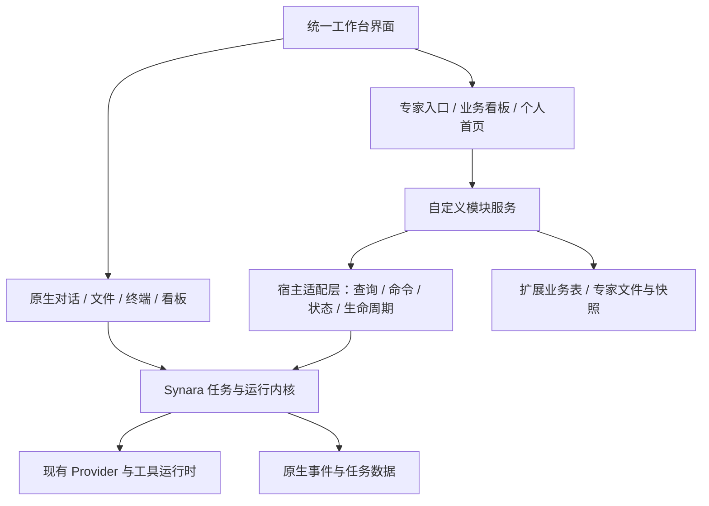

# 基于 Synara 的个人工作台架构

状态：架构基线与分阶段实施记录。当前范围为 WB-00 至 WB-05；WB-06 按用户决定延期。状态核实日期：2026-10-01。最新固定门禁、诊断构建和启动 smoke 绑定源码 SHA `8584249e19313471fe4e22f7ae7eca277f5ccf14`。它是 `9591dcda2607b4d81574ac5c25bc6e8d30c7ca80` 的直接子提交，只修改 `.github/scripts/workbench-weekly.test.mjs` 中的合成 lineage fixture。文档草稿分支 `codex/workbench-858-progress` 从 858 建立；后续文档提交不改变被测源码 SHA，也不自动继承新的运行证据。

基线关系见 [WB-00 记录](../workbench/WB-00-baseline.md) 与 [上游历史补充](../workbench/WB-00-upstream-evidence.md)：2026-09-29 原工作区基线为 `eaa61eded31b6755d4f30ba8eabc5d905cf817cb`，官方 `upstream/main` 与 `v0.9.2` 的共同基点为 `a33435c18474eb7816582004e45f87382965ac8d`。WB-04 在隔离候选分支从 `b608f0c17fcbc69ee7735cb6bd3d82d9e4d6801b` merge 固定的 `v0.9.2`，merge 提交为 `1309416dc3aefdc62e6edec1b2a4ed6d46f4e89c`。fee08 acceptance attempt 有两项固定门禁失败，首次 Codex 普通首轮请求因模型不支持返回 HTTP 400；9591 六项固定门禁通过，但其独立本地 weekly fixture 失败且没有 Provider 请求。相关失败按源码保留为历史。858 是 9591 的直接子提交，仅修正 weekly 测试 fixture；858 的最新证据见 [WB-04 858 证据](../workbench/WB-04-858-evidence.md)。`upstream.lock` 的 `integratedBase` 仍是 `v0.9.1`，候选尚未提升为已验证集成基线。

当前状态按源码 SHA 区分：WB-00 已完成。WB-01 在 858 上的两种 macOS arm64 诊断包、payload 与静态身份核对、三应用并存、隔离目录及两款工作台 updater-policy 检查通过；ad-hoc 本机签名不是 Developer ID 发布签名，原版 updater 未读取。WB-02 在 858 上的三个合成 file-backed SQLite 场景通过：前两项由 pinned Bun harness 执行，第三项用实际打包 Workbench Electron 43.4.1 的 Node mode 执行 restore CLI；未访问用户数据库，也没有证明普通 Electron 启动迁移。WB-03 的接入代码和聚焦检查已集成；fee08 的 Codex 普通首轮因模型不受支持返回 HTTP 400，9591 与 858 均没有 Provider 请求，模型选择等待用户授权。WB-04 的 858 六项固定门禁、两种诊断构建、启动 smoke、payload/身份核对和合成迁移演练均按各自范围通过；十项 required runtime evidence 尚未组装并绑定，其中八项产品 Provider 检查未运行，包身份与合成 restore 已有独立通过证据，状态仍为 `awaiting-runtime`。WB-05 的 9591 本地 Git fixture 失败；858 修正合成 fixture 后本地通过，生产 bind/CAS guard 未削弱，远端 manual/scheduled workflow 仍未运行。WB-06 按用户决定延期。M1/M2/M3 均未完成，`integratedBase` 仍为 `v0.9.1`，`main` 仍为 `8e5c12b963e3dd143837aa751e1749b5b55f5d73`。当前详细证据见 [WB-04 858 证据](../workbench/WB-04-858-evidence.md)；[WB-04 9591 证据](../workbench/WB-04-9591-evidence.md) 保留对应旧 SHA 的历史结果。另见 [WB-01 证据](../workbench/WB-01-evidence.md)、[WB-04 runtime preflight](../workbench/WB-04-runtime-preflight.md)、[WB-05 自动化记录](../workbench/WB-05-automation.md) 和[实施计划](./workbench-implementation-plan.md)。

隔离检查设计为核对互异的产品 `session.threadId`、准确专家绑定和 persona 不串线；当前产品 RPC 不暴露 Provider 原生 `providerSessionId`，因此不能据此声称原生 Provider session ID 隔离已证明。该产品 live probe 尚未在源码 SHA 858 上运行。

后续实施见 [落地技术方案与计划](./workbench-implementation-plan.md)，其中已细化文件位置、迁移接管、验收与每周同步任务。

## 快速导航

- [判断与取舍](#1-判断与取舍)
- [现有能力与限制](#2-现有能力与限制)
- [模块与接入边界](#3-模块与接入边界)
- [看板示例](#4-看板示例)
- [数据与升级](#5-数据与升级)
- [每周同步](#6-每周同步)
- [应用安装与回退](#7-应用安装与回退)
- [落地顺序](#8-落地顺序)

## 1. 判断与取舍

技术上可行，推荐在现有 fork 内做模块化扩展，继续使用 Synara 的 Web、server 和 desktop 架构。主要维护成本来自接入位置和行为差异：修改会话启动、恢复、权限、事件持久化越多，上游适配成本越高；独立页面、个人配置和业务数据通常更容易维护。

一周一次是合理的维护节奏，能批量处理更新和验证。它不保证一周一次必定发布：有阻塞问题就保留上个可用版本，继续处理同一个候选。官方日后主动删除或重新定义某项功能时，仍需决定是否独立维护该功能，不能承诺永久保留所有历史行为。

| 路径                                         | 优点                                         | 成本与适用边界                                 | 判断                                   |
| -------------------------------------------- | -------------------------------------------- | ---------------------------------------------- | -------------------------------------- |
| 在 fork 中集中维护模块和少量接入点           | 一套界面，保留现有会话与工具，专家能深度接入 | 需要持续维护接入点                             | 推荐                                   |
| 单独做工作台，经外部 API/MCP 连接原版 Synara | 与官方源码耦合较少                           | 界面和数据分离；专家生命周期所需接口未证明齐全 | 适合独立报表或外部服务，暂不作为主架构 |
| 自建通用动态插件平台                         | 将来可安装第三方模块                         | 权限、版本、加载、隔离和兼容性工作量很大       | 等真实模块积累后再评估                 |

本方案中的“模块注册表”和“宿主适配层”是我们要建立并维护的内部边界，不是已存在的 Synara 稳定插件 SDK。

## 2. 现有能力与限制

| 已核实事实                                                         | 对设计的影响                                                                                                      | 本地依据                                                                                                                                                                                                                             |
| ------------------------------------------------------------------ | ----------------------------------------------------------------------------------------------------------------- | ------------------------------------------------------------------------------------------------------------------------------------------------------------------------------------------------------------------------------------ |
| Task/Thread 拥有对话、Provider session、环境和工作状态             | 自定义功能复用任务系统，不再建第二套执行器                                                                        | [核心概念](./core-concepts.md)                                                                                                                                                                                                       |
| 已有全局和项目 Kanban，由线程与草稿派生 Draft / In Progress / Done | 若只是管理 AI 任务，先复用；业务事项才新增模型                                                                    | [看板逻辑](../apps/web/src/components/kanban/kanban.logic.ts)、[看板页面](../apps/web/src/components/kanban/KanbanView.tsx)                                                                                                          |
| Plugins 页面使用 Provider 发现的插件和 Skills                      | 不能据此认定支持安装任意 React 页面或业务后端                                                                     | [PluginLibrary](../apps/web/src/components/PluginLibrary.tsx)                                                                                                                                                                        |
| 专家功能已跨协议、会话、Gateway、UI、持久化接入                    | 保留必要的深度接入；把新增业务逻辑从接入文件中收拢                                                                | [专家方案](./expert-product-technical-design.md)                                                                                                                                                                                     |
| 旧 fork 曾把专家迁移记为 109、110；官方 `v0.9.2` 发布清单止于 108  | 专家扩展改用 Workbench 自有迁移 ledger；仅按精确历史身份与 schema 接纳旧库中的 109、110，不把它们当成官方发布迁移 | [Workbench migrations](../apps/server/src/workbench/persistence/WorkbenchMigrations.ts)、[遗留迁移接纳](../apps/server/src/workbench/persistence/LegacyExpertMigrationAdoption.ts)、[WB-02 计划](./workbench-implementation-plan.md) |
| desktop 已集中管理应用身份；Canary 有独立目录与脚本更新            | 扩展已有机制，建立自己的安装身份和更新源                                                                          | [桌面身份](../packages/shared/src/desktopIdentity.ts)、[Canary](./canary.md)、[发布说明](./release.md)                                                                                                                               |

在线核实：截至核实日期，官方发布页将 `v0.9.2` 标为 Latest，`v0.9.3-beta.1` 标为预发布。`v0.9.2` 的官方迁移清单止于 108；尚不能据此声称已与我们的 109、110 发生实际编号冲突。[官方发布页](https://github.com/Emanuele-web04/synara/releases)、[v0.9.2 迁移源码](https://raw.githubusercontent.com/Emanuele-web04/synara/v0.9.2/apps/server/src/persistence/Migrations.ts)。

## 3. 模块与接入边界

概念结构如下；可编辑源图见 [工作台架构图](./workbench-architecture.drawio)。



原生页面和自定义页面共用现有应用外壳、路由、基础组件与字体设置。新增业务页按需挂载，避免让看板、统计等功能进入对话流式渲染的高频路径。先建立编译时注册的模块，不加载任意第三方界面代码。

建议五类接入点：

| 接入点             | 负责什么                               | 边界                                                   |
| ------------------ | -------------------------------------- | ------------------------------------------------------ |
| 页面与导航注册     | 加入业务页、设置页、必要的选择入口     | 复用原有壳和 UI 组件，不复制整个 Sidebar 或 ChatView   |
| 类型化业务 RPC     | 专家、看板等业务请求                   | 复用认证、连接和错误处理；跨进程 Schema 仍放 contracts |
| 任务查询与命令适配 | 查任务、创建任务、提交、取消、打开会话 | 复用已有命令校验和授权；不直写任务状态表               |
| 状态适配           | 给业务页提供任务状态和可用能力         | 复用应用状态/快照；断线重连后补齐，避免只靠一次事件    |
| 生命周期与启动装配 | 专家启动/恢复、扩展数据准备、退出清理  | 关键路径明确失败；保留 session 所有权和取消传播        |

模块只申请自己需要的接口，例如 `ThreadQuery`、`ThreadCommands`、`ExpertBinding`。这些名称是建议的职责划分，实施时先查现有服务并复用，不另包一层与原接口完全重复的 API。

Provider 专有行为仍在各 Adapter 内。宿主适配层只收拢调用和兼容处理，不能假设 Codex 与 Pi 的资源加载、授权或恢复方式一致，也不能建立绕过原生权限的后门。

以下目录中，Workbench 注册、专家迁移和同步工具已有实现；看板与个人首页仍是后续模块示例：

```text
apps/web/src/workbench/
  registry.ts                 自定义页面与设置入口的静态注册
  host/                       封装需要对接原生状态/命令的部分
  features/boards/             新增的业务看板
  features/home/               个人工作首页

apps/server/src/workbench/
  host/                       宿主服务适配与装配
  features/boards/             业务事项与线程关联
  persistence/                自定义表与独立迁移记录

apps/server/src/experts/        复用已有专家逻辑，无需立即搬目录
packages/contracts/src/workbench/boards.ts
packages/contracts/src/expert.ts
workbench/upstream.lock.json   记录集成的官方 ref 和完整 SHA
```

contracts 仅承载跨进程结构；运行逻辑放 server/web，公共运行工具沿用 shared 的显式子路径。模块导入原生基础 UI 或公共工具可以直接复用；访问原生任务内部、数据写入和运行控制集中在约定的接入文件。用轻量导入约束防止依赖逐渐扩散，不以目录名宣称已实现隔离。

模块开关可以关闭页面与新业务请求，不能删除数据或跳过必要迁移。已有任务绑定的专家不可因为开关或适配失败而静默退化为通用助手；应保持可诊断的失败/待恢复状态。

## 4. 看板示例

当前原生 Kanban 适合查看 AI 任务的执行状态。若想做“论文、求职、项目需求”等长期事项，建议新建 `WorkItem`，并关联零到多个 Synara Thread，支持尚未交给 AI 的事项和多轮执行。

| 对象                            | 由谁负责                                       |
| ------------------------------- | ---------------------------------------------- |
| Board / Column / WorkItem       | 工作台模块保存自定义列、排序、业务状态、期限等 |
| WorkItemThreadLink              | 记录事项与线程关联及执行用途                   |
| Thread / Turn / ProviderSession | Synara 保存执行、对话、审批、恢复、取消        |
| ExpertSnapshot                  | 专家系统固定本次使用的能力版本                 |

以“写论文方法章节”为例：先建事项，再点击“交给研究员专家”，由现有任务创建/启动路径创建线程并绑定专家快照；看板显示执行状态和打开对话入口。AI 结束一轮后显示“等待验收”，业务完成由用户或明确配置的规则确定。拖动卡片默认只改变业务状态，避免一次拖拽意外启动模型或取消正在执行的任务。

执行命令使用稳定的请求标识，复用已有幂等机制；崩溃重试不能重复创建线程。关联写入与任务创建尽可能共用现有事务；若无法同事务，记录可恢复的待关联操作，再按请求标识核对。线程被归档或删除时保留可解释的关联状态，重连后用快照校准，不伪装成仍在运行。

## 5. 数据与升级

**建议继续使用现有 SQLite 连接与事务体系，但将自定义业务表和迁移记录分开管理。**第一阶段不为看板另起数据库或服务，避免增加跨库一致性成本。

- 原生表和官方迁移历史由上游管理。
- 新增业务表采用 `wb_` 前缀，例如 `wb_work_items`、`wb_item_threads`；名称是设计示例。
- 扩展迁移用独立记录表，例如 `workbench_sql_migrations`，独立校验版本、顺序和执行结果。不能只把官方迁移编号改成很大的数，现有 migrator 的最高编号规则会受影响。
- 启动时分别检查官方与扩展 schema 是否超出当前程序支持范围；过新或未知状态拒绝写入，不能仅因为官方版本兼容就运行旧扩展代码。
- 专家源文件与不可变快照继续使用已有存储方式，路径由应用数据目录解析；代码更新不覆盖用户专家文件。
- 必須与任务原子生效的专家绑定仍进入持久化事件/投影流程；扩展投影若拆为独立表，需与原生投影共用事务边界，并证明可重放、可恢复。普通看板统计可从快照派生。

首轮落地采用渐进方式：现有 `expert_binding_json` 列与专家运行记录表作为已知历史扩展，先保留物理结构并拆分迁移归属；新业务表独立命名。是否搬迁现有投影以后单独评估，避免首次上游同步与无必要的数据搬迁同时发生。

当前 109、110 的迁移记录是首次同步前的重点。先查明是否有实际使用的数据库已经执行它们；“未提交到 Git”不等于“没有运行过”。已经落库的记录不能直接改号、改名或删除。

需要一个专门的历史接管步骤：备份一致性数据，识别确切的自定义历史身份和实际 schema，把已执行状态有依据地接入扩展迁移历史。若必须规范官方 tracker 中的旧自定义记录，需以可重复、可恢复、受测试覆盖的迁移完成，并在官方 lineage 检查之前处理；遇到未知身份停止，不能让通用历史修复逻辑误判。随后执行官方迁移，再执行依赖它的新扩展迁移，完成前不开业务服务。具体转换方案须在真实数据副本上验证后定稿。

验证样本至少包含：空库、旧官方库、已执行专家 109/110 的库、上周工作台库；还要覆盖升级中断重试、投影重建及自定义业务数据保留。

## 6. 每周同步

### 6.1 更新来源与分支

`upstream` 指向官方，`origin` 指向自己的仓库。我们的 `main` 保持已验证的集成版本；功能开发用 `codex/feature-*`，每次同步用 `codex/sync-*`，从当时的可用版本出发。

首次准备包括：审查并保存当前改动、配置 upstream、补齐浅克隆历史及验证所需的官方发布标签、确认共同祖先和基线。已有工作区正在开发时，在独立 worktree 中准备候选，不把周同步合并塞入活动工作区。

更新采用 merge，保留双方历史。长期共享分支不反复 rebase，也不每周复制整份源码或重复粘贴专家补丁。

### 6.2 选择哪个官方版本

推荐每周固定窗口检查一次，默认选择最新的官方非预发布版本，并固定其完整 commit SHA。以本次在线核实为例，默认候选是 `v0.9.2`，不是 `v0.9.3-beta.1`。

若本地已集成的官方提交比最新稳定版更靠前，或来自不同发布线，不能回退或盲目合并：检查祖先关系后等待包含当前基线的新稳定版本，或明确改用一条开发线。实验性的 `upstream/main` 可以单独评估，不自动切换日用渠道。

当周多个官方发布只取本次窗口的目标快照；没有新目标则跳过。候选准备过程中官方继续发布，也不改变本次目标。个人新功能和修复可独立开发，无需每天同步官方。

### 6.3 一次同步的完整流程

1. **获取与比对**：获取官方引用，确认来源、基线、锁定 SHA；列出变化，重点关注 contracts、Provider、数据迁移、平台进程、UI 接入和依赖补丁。
2. **准备候选**：独立工作区合并官方目标，处理文本冲突和行为差异；记录接入点调整。已有未完成候选时继续它，避免重复建分支。
3. **自动检查**：执行 `bun run fmt:check`、`bun run lint`、`bun run typecheck`、相关 Vitest；跨包/生命周期变化执行 `bun run test`。迁移变化执行 `bun run migrations:check`，平台/进程变化执行 `bun run windows-runtime:check`。扩展迁移另有对应检查，不能认为官方脚本已覆盖它。
4. **隔离试用**：复用 dev/Canary 的隔离能力，用独立应用数据目录与端口验证真实运行；升级试验用一致性数据副本。验证原生对话、取消、审批、重连，以及专家加载、旧任务恢复、MCP、看板关联。
5. **准备自用版本**：产出已验证提交和构建信息。通过检查且运行时空闲后，进入安装窗口；有活动任务先等待或明确结束，不能定时强制中断。
6. **记录结果**：保存官方 SHA、工作台版本、验证结果和待处理问题。失败时继续使用旧版，修复候选；下一次获取更新前仍能定位上次停在哪一步。

每周自动化的第一版负责检查、准备候选和报告；正式合并、发布、生产安装按已授权范围执行。无更新或状态无变化时保持安静，只在候选就绪、失败或需要处理时通知。后续可在反复验证可靠后，明确授权符合条件的自动升级。此文档没有创建定时任务；具体星期和时间在落地时配置，时区采用 Asia/Shanghai。

调度应运行在更新工具或 CI 中，不能依赖被升级的应用正在健康运行。复用现有 CI/构建脚本；首次个人使用可在本机做隔离构建，是否引入远程 CI 取决于设备和发布需求。

### 6.4 可追踪版本

仓库内建议记录官方仓库、ref、完整 SHA 和集成策略；只有候选验证通过才推进已集成基线。构建时另外写入工作台版本、工作台自身 SHA、官方 SHA 和两套 schema 版本。工作台应用版本独立递增，不把自定义版本冒充官方版本。自己的发布标签建议采用 `workbench-v*`，与官方标签及现有官方发布触发规则区分。

## 7. 应用安装与回退

源码更新来自官方，安装包应来自我们验证后的工作台构建。若继续使用官方二进制更新源，下载安装官方成品会丢失自定义代码。

沿用现有 [desktopIdentity](../packages/shared/src/desktopIdentity.ts) 与构建配置建立自己的身份：名称、bundle ID、URL scheme、Electron userData、应用数据目录和更新渠道成套设置，不能只改显示名称。日用版、候选版、原版 Synara 分别使用数据目录，避免互相打开同一数据库。

日用 Workbench 可用 `SYNARA_WORKBENCH_HOME` 覆盖自己的应用数据目录；候选版使用 `SYNARA_WORKBENCH_PREVIEW_HOME`。未设置时两者分别使用身份定义的默认目录，并忽略通用 `SYNARA_HOME`，避免继承到 Stable 的数据目录。Beta 仍读取 `SYNARA_BETA_HOME`，其他 flavor 保持原有 `SYNARA_HOME` 规则。

第一阶段复用 Canary 的固定提交/脚本更新思路，但现有 Canary 命令不会自动完成官方合并、扩展兼容检查或数据回退；只有已验证的自定义提交才能成为安装目标。以后需要安装包分发时，再配置自己的发布仓库与更新元数据，复用现有打包器。设置更新仓库不能替代应用身份、签名或实机安装验证。构建检查应核对实际写入安装包的身份和更新地址，避免遗漏配置后回落到官方渠道。

回退分为两种：

- 数据格式向后兼容且已验证时，可以回退程序。
- 数据已发生不兼容迁移时，需要旧程序与升级前的一致性数据备份配套恢复；先保留故障后的数据，明确升级后新增工作不会凭空合并回旧备份。不能把 `git reset` 或现有 `canary:rollback` 当作完整数据回退。

备份覆盖 SQLite 的一致性状态、专家快照与必要的工作台文件；不能在运行中只复制主数据库文件。优先复用已有迁移备份设施，补齐扩展文件和恢复演练。

## 8. 落地顺序

| 阶段                  | 交付                                                     | 验收                                             |
| --------------------- | -------------------------------------------------------- | ------------------------------------------------ |
| A：建立可恢复基线     | 保存专家改动，配置 upstream，补齐历史，记录基线          | 能区分官方原始代码、自定义代码和运行数据         |
| B：处理升级边界       | 自定义应用身份、扩展迁移记录与旧数据接管、少量宿主接入点 | 原生能力和专家原有场景继续工作，旧数据可升级     |
| C：完成一次手动周同步 | 合并固定官方版本，隔离测试、构建、恢复演练               | 实际证明一次更新后专家能力可用                   |
| D：自动化每周候选     | 定时获取、同一候选续跑、自动检查、结果通知               | 无重复任务、失败可追踪，运行版本稳定             |
| E：增加业务看板       | 复用原有看板组件，按需增加 WorkItem 与线程关联           | 新能力主要位于自定义目录，原生接入修改集中可解释 |

实施后跟踪每次同步的冲突文件、实际适配位置、验证耗时和阻塞原因。两到三次同步后，再用真实记录判断是否需要抽出更多接口；现在不承诺固定分钟数或零维护成本。

## 初始设计验证范围（历史快照）

方案形成初期已检查源码中的任务所有权、看板、插件页面、专家接入、迁移历史、应用身份和更新机制，并在线核实官方稳定/预发布信息；当时尚未计算完整的本地与官方差异或执行 merge/真实升级。该初始设计快照中的“未执行 merge”“仅配置 origin”“Git 仍是浅克隆”及 GitHub 代理连接失败是当时记录的历史状态；尤其浅克隆与远端配置的观察反映 WB-00 补齐历史之前的起点，已被后续工作取代，不表示当前状态。当前候选和运行证据以本文开头绑定的实际执行源码 SHA 858、相关专项证据页与 [实施计划](./workbench-implementation-plan.md) 为准；9591 和 fee08 的历史证据仍按各自 SHA 保留。
